# GatePass

Real-time visitor management system for apartment complexes. Security guards and residents use separate apps that stay in sync through a NestJS API with Socket.IO and Redis Pub/Sub -- no polling, all push.

## Stack

| Layer | Technology |
|---|---|
| Security Frontend | React 18, Vite, Tailwind CSS, React Router, Socket.IO Client |
| Resident Frontend | React 18, Vite, Tailwind CSS, React Router, Socket.IO Client |
| API | NestJS 10, TypeORM 0.3, Socket.IO 4, class-validator |
| Database | PostgreSQL 16 |
| Event Bus | Redis 7 Pub/Sub |
| Containerisation | Docker, Docker Compose |

## Architecture

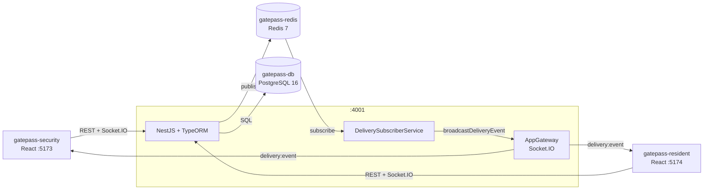

### How it works

Everything runs inside the `gatepass-api` process. There is no separate notification service.

1. A REST call mutates PostgreSQL via TypeORM.
2. `EventsService` publishes a JSON event to the Redis `delivery-events` channel.
3. `DeliverySubscriberService` (an in-process Redis subscriber) receives the event, deduplicates it by `type:id`, and calls `AppGateway.broadcastDeliveryEvent()` directly -- no network hop.
4. `AppGateway` emits `delivery:event` to the correct Socket.IO rooms.

## Containers

| Container | Image | Port | Role |
|---|---|---|---|
| `gatepass-db` | postgres:16-alpine | internal | PostgreSQL, data persisted in `postgres_data` volume |
| `gatepass-redis` | redis:7-alpine | internal | Redis with AOF persistence |
| `gatepass-api` | gatepass-api (multi-stage build) | 4001 | NestJS REST + Socket.IO + Redis subscriber |
| `gatepass-security` | gatepass-security (Vite) | 5173 | Security guard web app |
| `gatepass-resident` | gatepass-resident (Vite) | 5174 | Resident web app |

## Project Structure

```text
visitor-management/
+-- gatepass-api/                      NestJS backend
|   +-- src/
|   |   +-- main.ts                    Bootstrap: CORS, validation pipe, body limit, graceful shutdown
|   |   +-- app.module.ts              Root module: TypeORM config, feature module imports
|   |   +-- users/
|   |   |   +-- user.entity.ts         TypeORM entity -- users table
|   |   |   +-- users.service.ts       Login validation, resident/officer queries
|   |   |   `-- users.controller.ts    POST /users/login/*, GET /users/residents, /users/security
|   |   +-- deliveries/
|   |   |   +-- delivery.entity.ts     TypeORM entity -- deliveries table
|   |   |   +-- deliveries.service.ts  Business logic, publishes Redis events
|   |   |   +-- deliveries.controller.ts
|   |   |   `-- dto/
|   |   |       +-- create-delivery.dto.ts
|   |   |       `-- query-delivery.dto.ts
|   |   +-- chat/
|   |   |   +-- chat-message.entity.ts TypeORM entity -- chat_messages table
|   |   |   +-- chat.service.ts        Thread history and persistence
|   |   |   `-- chat.controller.ts     GET /chat/history, GET /chat/threads
|   |   +-- watchlist/
|   |   |   +-- watchlist.entity.ts    TypeORM entity -- watchlist table
|   |   |   +-- watchlist.service.ts   ILIKE name match + exact phone match
|   |   |   +-- watchlist.controller.ts
|   |   |   `-- dto/create-watchlist.dto.ts
|   |   +-- preregistrations/
|   |   |   +-- preregistration.entity.ts  visitor_preregistrations table
|   |   |   +-- preregistrations.service.ts
|   |   |   +-- preregistrations.controller.ts
|   |   |   `-- dto/create-preregistration.dto.ts
|   |   +-- instructions/
|   |   |   +-- unit-instruction.entity.ts  unit_instructions table (unit PK)
|   |   |   +-- instructions.service.ts     PostgreSQL UPSERT ON CONFLICT
|   |   |   +-- instructions.controller.ts
|   |   |   `-- dto/save-instruction.dto.ts
|   |   +-- gateway/
|   |   |   +-- app.gateway.ts         @WebSocketGateway -- all Socket.IO logic
|   |   |   `-- gateway.module.ts
|   |   +-- events/
|   |   |   +-- events.service.ts      Redis publisher (fire-and-forget)
|   |   |   +-- delivery-subscriber.service.ts  Redis subscriber -> AppGateway
|   |   |   `-- events.module.ts
|   |   +-- health/
|   |   |   `-- health.controller.ts   GET /health -- DataSource ping
|   |   `-- common/
|   |       `-- filters/all-exceptions.filter.ts  Global HTTP exception filter
|   +-- Dockerfile                     Multi-stage: builder (tsc) + runner (prod deps only)
|   +-- nest-cli.json
|   +-- tsconfig.json
|   `-- package.json
|
+-- gatepass-security/                 Security guard React app (port 5173)
|   `-- src/
|       +-- App.jsx                    Router + login guard
|       +-- context/SecurityAppContext.jsx  Global state + Socket.IO lifecycle
|       +-- pages/security/
|       |   +-- HomePage.jsx           Dashboard: stats, pending approvals, inside-now list
|       |   +-- LiveStatusPage.jsx     Filterable full delivery table
|       |   +-- CreateDeliveryPage.jsx Delivery log form with pre-reg hints and watchlist check
|       |   +-- NotificationsPage.jsx  In-app activity feed
|       |   `-- ChatPage.jsx           Per-thread messaging with residents and officers
|       +-- components/security/
|       |   +-- SecurityLayout.jsx     App shell with sidebar nav and emergency alert button
|       |   +-- SecurityNav.jsx        Navigation links with unread badge counts
|       |   +-- SecurityStats.jsx      Stat cards (today / pending / inside / exited)
|       |   +-- LoginScreen.jsx        PIN-based login against /users/login/security
|       |   +-- GateSetupScreen.jsx    First-run gate + officer name setup (localStorage)
|       |   `-- ChatTick.jsx           Message delivery status tick icon
|       +-- components/
|       |   +-- StatusBadge.jsx        Pill badge for approval/delivery status
|       |   `-- ConnectionBanner.jsx   Offline/reconnecting banner
|       +-- services/
|       |   +-- api.js                 fetch wrapper (15 s timeout, AbortController)
|       |   `-- socket.js             createSocket() factory
|       `-- constants/mobileOptions.js  SECURITY_UNITS, GATES, VISITOR_CATEGORIES, DELIVERY_PROFILES
|
+-- gatepass-resident/                 Resident React app (port 5174)
|   `-- src/
|       +-- App.jsx                    Login guard + unit selection
|       +-- context/ResidentAppContext.jsx  Global state + Socket.IO + browser notifications
|       +-- pages/resident/
|       |   +-- HomePage.jsx           Incoming visitor/delivery cards: approve/reject + instructions
|       |   +-- VisitorsPage.jsx       Pre-registered visitors: add/remove
|       |   +-- NotificationsPage.jsx  In-app notification feed with browser permission toggle
|       |   `-- ChatPage.jsx           Per-thread messaging with security and other residents
|       +-- components/resident/
|       |   +-- ResidentLayout.jsx     App shell with bottom nav and emergency alert overlay
|       |   +-- ResidentNav.jsx        Navigation links with unread badge counts
|       |   `-- LoginScreen.jsx        PIN-based login against /users/login/resident
|       +-- components/
|       |   `-- ConnectionBanner.jsx   Offline/reconnecting banner
|       +-- services/
|       |   +-- api.js                 fetch wrapper (15 s timeout, AbortController)
|       |   +-- socket.js             createSocket() factory
|       |   `-- browserNotifications.js  Web Notifications API wrapper
|       `-- constants/mobileOptions.js  RESIDENT_UNITS, VISITOR_CATEGORIES
|
+-- db/
|   +-- init/01_schema.sql             Schema + seed -- run automatically on first DB container start
|   `-- seed_users.sql                 Standalone re-seed script (run manually against a running DB)
+-- docker-compose.yml
+-- .env.example                       Copy to .env and set POSTGRES_PASSWORD before deploying
`-- deploy.ps1                         One-shot PowerShell deploy script
```

## Setup and Deployment

### Prerequisites

- [Docker Desktop](https://www.docker.com/products/docker-desktop/) (includes Docker Compose v2)
- PowerShell 5.1+ (Windows) or PowerShell 7+ (cross-platform)

### Option A -- Deploy script (recommended)

```powershell
# First run -- prompts for DB password, creates .env, builds images, starts all containers
.\deploy.ps1

# Rebuild all images (e.g. after a code change)
.\deploy.ps1 -Build

# Tear down containers then rebuild (DB volume is preserved)
.\deploy.ps1 -Down -Build

# Start and follow all logs
.\deploy.ps1 -Logs
```

### Option B -- Manual

**1. Create `.env`**

```powershell
Copy-Item .env.example .env
```

Open `.env` and set a strong `POSTGRES_PASSWORD`. Update `DATABASE_URL` to match.

**2. Build and start**

```powershell
docker compose up --build --detach
```

**3. Verify health**

```powershell
docker compose ps
```

All containers should show `healthy` or `running`. The API exposes `GET /health` which is polled by the Docker health-check.

### Stopping

```powershell
docker compose down        # stop containers, keep DB volume
docker compose down -v     # stop + delete DB volume (data loss)
```

### Opening the apps

| App | URL |
|---|---|
| Security dashboard | http://localhost:5173 |
| Resident portal | http://localhost:5174 |
| API health | http://localhost:4001/health |

## Environment Variables

| Variable | Default | Description |
|---|---|---|
| `POSTGRES_USER` | `visitor_admin` | DB username |
| `POSTGRES_PASSWORD` | -- | DB password. **Must be changed before deploying.** |
| `POSTGRES_DB` | `visitor_management` | DB name |
| `DATABASE_URL` | see `.env.example` | Full PostgreSQL connection URL (must match above) |
| `REDIS_URL` | `redis://redis:6379` | Redis connection URL |
| `DELIVERY_EVENTS_CHANNEL` | `delivery-events` | Redis Pub/Sub channel name |
| `API_PORT` | `4001` | Port the NestJS process listens on inside the container |
| `CORS_ORIGIN` | `http://localhost:5173,http://localhost:5174` | Comma-separated allowed origins |
| `VITE_API_BASE_URL` | `http://localhost:4001` | REST base URL -- baked into frontend build |
| `VITE_SOCKET_URL` | `http://localhost:4001` | Socket.IO URL -- baked into frontend build |

## Seed Data

`db/init/01_schema.sql` is executed automatically when the PostgreSQL container is first created. It creates all tables, indexes, and inserts seed users.

Seed users follow a fixed convention:

| Role | User ID format | Example |
|---|---|---|
| Resident | `<flat-lowercase><2-digit-seq>` | flat A101 -> `a10101`, `a10102` |
| Security | `security1` ... `security5` | Main Gate -> `security1` |

To re-seed an existing database manually:

```powershell
docker exec -i gatepass-db psql -U visitor_admin -d visitor_management < db/seed_users.sql
```

## Workflows

### 1. Visitor / Delivery Entry

Security logs a visitor or delivery at the gate. The entry is broadcast instantly to the security dashboard and the resident's unit.

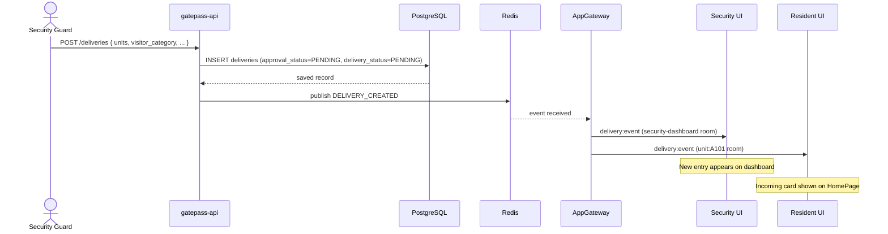

### 2. Resident Approves or Rejects

The resident reviews the incoming card and approves or rejects the entry request.

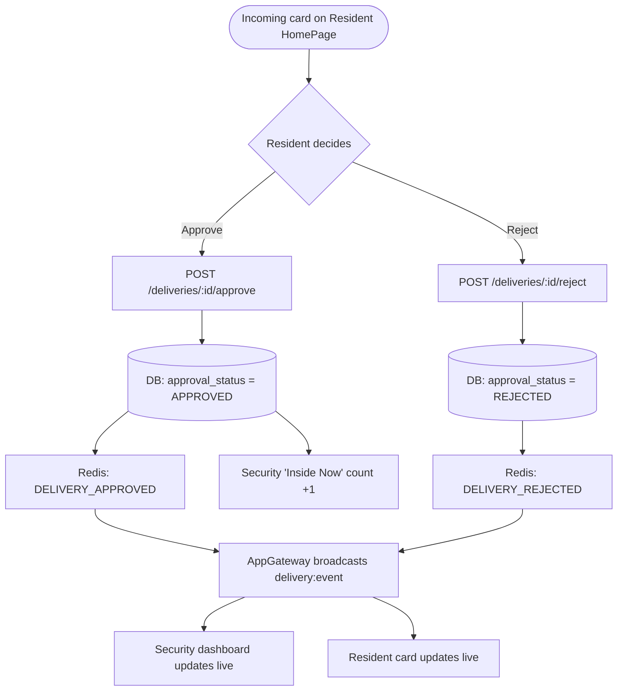

### 3. Visitor Exit

Security marks the visitor as exited when they leave. All records for the same person on the same day are exited together.

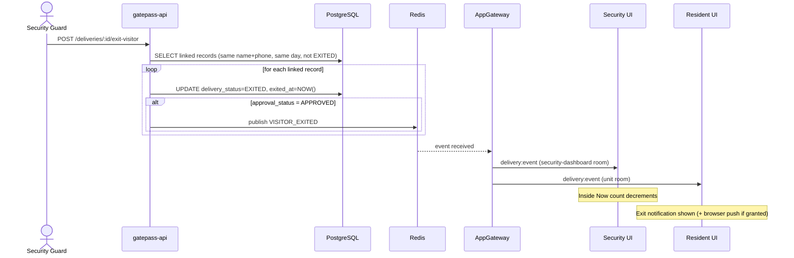

### 4. Real-Time Chat

Three conversation types are supported, all using the same `chat:send` event. Messages are persisted in `chat_messages` and pre-loaded on socket connect.

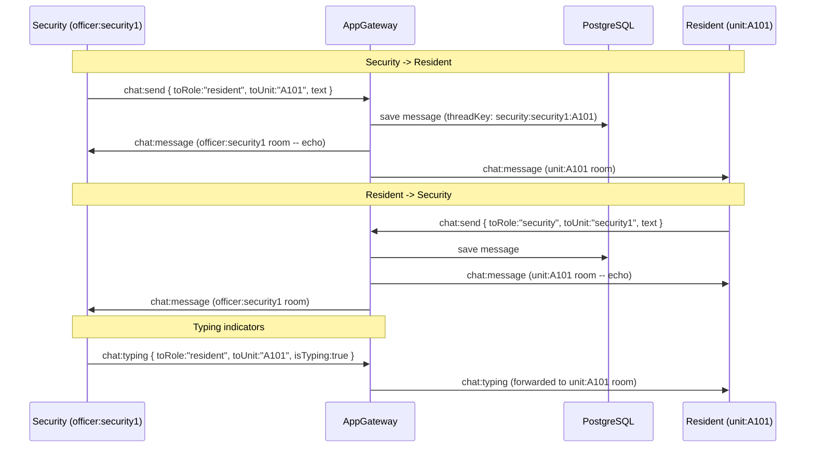

**Thread key format**

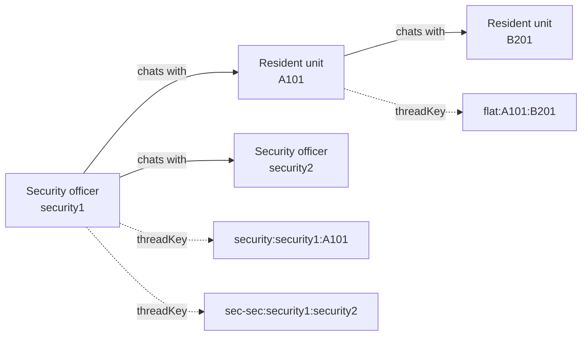

### 5. Emergency Alert

Only security clients (in `security-dashboard` room) can broadcast. The alert is sent to every connected client immediately.

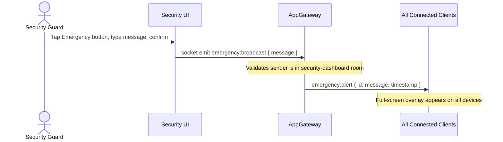

### 6. Pre-Registration

Residents pre-register expected visitors so security can log them with one click.

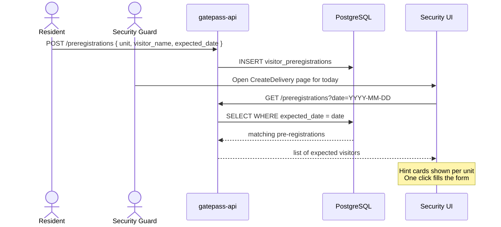

### 7. Watchlist Check

An automatic background check runs as the security officer types a visitor name or phone number.

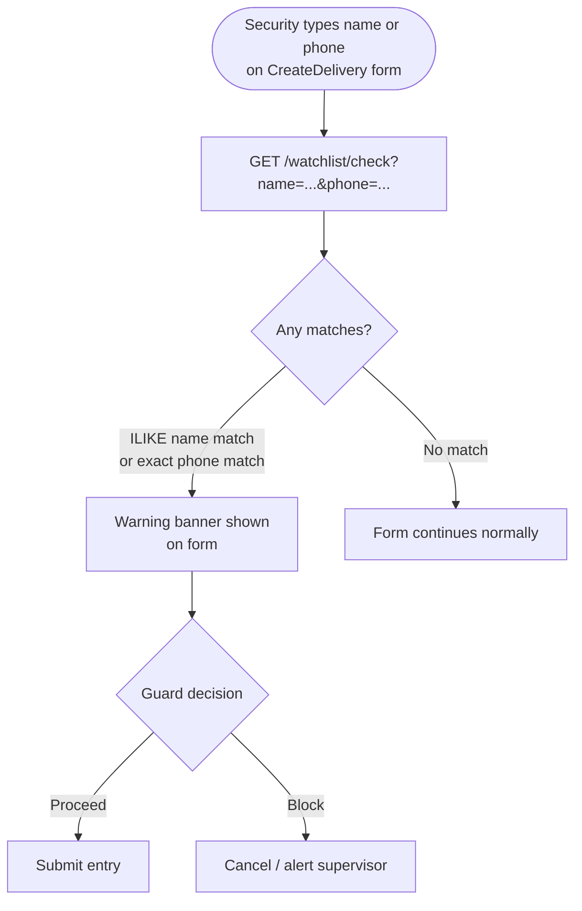

### 8. Unit Instructions

Residents set standing delivery instructions once; security sees them inline when logging a visitor for that unit.

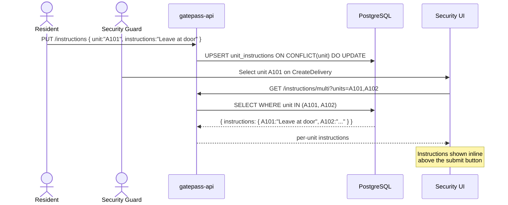

## Delivery Status State Machine

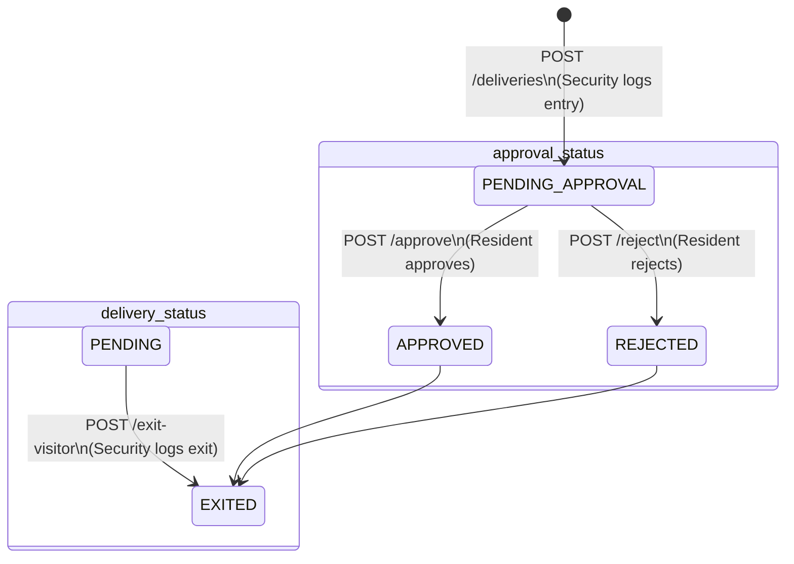

## API Reference

### Authentication

| Method | Path | Description |
|---|---|---|
| `POST` | `/users/login/resident` | Authenticate a resident. Rejects security accounts. Body: `{ id, pin }` |
| `POST` | `/users/login/security` | Authenticate a security officer. Rejects resident accounts. Body: `{ id, pin }` |

Both endpoints return the user record (minus `pin`) plus a computed `name` field and update `last_seen_at`.

### Users

| Method | Path | Description |
|---|---|---|
| `GET` | `/users/residents` | All residents (id, name, unit, email, phone), ordered by unit |
| `GET` | `/users/residents/units` | Distinct unit codes that have at least one resident |
| `GET` | `/users/security` | All security officers (id, name, gate), ordered by gate |

### Deliveries

| Method | Path | Description |
|---|---|---|
| `GET` | `/deliveries` | List deliveries. Filters: `unit`, `approval_status`, `delivery_status`, `date` (YYYY-MM-DD), `gate`, `limit` (max 500) |
| `GET` | `/deliveries/recent-visitors` | Distinct visitors from last 30 days (`DISTINCT ON name+phone`), max 20 rows |
| `POST` | `/deliveries` | Create one row per unit in `units[]`. Publishes `DELIVERY_CREATED` |
| `POST` | `/deliveries/:id/approve` | Set `approval_status = APPROVED`. Publishes `DELIVERY_APPROVED` |
| `POST` | `/deliveries/:id/reject` | Set `approval_status = REJECTED`. Publishes `DELIVERY_REJECTED` |
| `POST` | `/deliveries/:id/exit-visitor` | Set `delivery_status = EXITED`, records `exited_at`. Exits all records for same visitor on same day. Publishes `VISITOR_EXITED` |

#### `POST /deliveries` request body

```json
{
  "delivery_person_name": "Ravi Kumar",
  "company": "BlueDart",
  "phone_number": "+91-9876543210",
  "units": ["A101", "A102"],
  "gate": "Main Gate",
  "visitor_category": "DELIVERY",
  "vehicle_number": "KA01AB1234",
  "parcel_image": "data:image/png;base64,..."
}
```

`units` must have at least one element. `parcel_image` is a base64 data URL (5 MB body limit). All other fields except `delivery_person_name` and `units` are optional.

#### Status values

| Field | Values |
|---|---|
| `approval_status` | `PENDING` -> `APPROVED` or `REJECTED` |
| `delivery_status` | `PENDING` -> `EXITED` |

#### Visitor categories

`DELIVERY`, `GUEST`, `DAILY_HELP`, `CAB`, `SERVICE`, `VENDOR`, `MEDICAL`, `OTHER`

### Chat

| Method | Path | Description |
|---|---|---|
| `GET` | `/chat/history?threadKey=<key>` | Up to 100 most-recent messages for the thread, oldest-first |
| `GET` | `/chat/threads?unit=A101` | Thread keys that involve this unit |

### Watchlist

| Method | Path | Description |
|---|---|---|
| `GET` | `/watchlist` | All entries, ordered by `created_at DESC` |
| `GET` | `/watchlist/check?name=&phone=` | ILIKE name match + exact phone match, up to 10 results |
| `POST` | `/watchlist` | Add entry. Body: `{ person_name, phone_number?, reason?, added_by? }` |
| `DELETE` | `/watchlist/:id` | Remove entry |

### Instructions

| Method | Path | Description |
|---|---|---|
| `GET` | `/instructions?unit=A101` | Get instructions for one unit |
| `GET` | `/instructions/multi?units=A101,A102` | Instructions for multiple units: `{ instructions: { A101: "...", A102: "..." } }` |
| `PUT` | `/instructions` | Upsert (`ON CONFLICT DO UPDATE`). Body: `{ unit, instructions }` |

### Pre-registrations

| Method | Path | Description |
|---|---|---|
| `GET` | `/preregistrations?unit=A101&date=2026-05-31` | List entries (both params optional) |
| `POST` | `/preregistrations` | Create. Body: `{ unit, visitor_name, expected_date, company?, purpose? }` |
| `DELETE` | `/preregistrations/:id` | Delete |

### Health

| Method | Path | Description |
|---|---|---|
| `GET` | `/health` | Returns `{ status: "ok" }` after a DataSource query ping. Used by Docker health-check |

## Socket.IO Reference

The WebSocket gateway shares the same port as the REST API (`4001`).

### Connecting

```js
import { io } from 'socket.io-client';

// Security client
const socket = io('http://localhost:4001', {
  transports: ['websocket'],
  auth: {
    role: 'security',
    officerId: 'security1',
    officerName: 'Ramesh Kumar',
    gate: 'Main Gate',
  },
});

// Resident client
const socket = io('http://localhost:4001', {
  transports: ['websocket'],
  auth: {
    role: 'resident',
    unit: 'A101',
    residentUserId: 'a10101',
    residentName: 'Arjun Sharma',
  },
});
```

### Rooms

| Room | Who joins | Purpose |
|---|---|---|
| `security-dashboard` | All security clients | Delivery event broadcasts |
| `officer:{officerId}` | The specific security officer | Private chat messages + echo |
| `unit:{UNIT}` | Resident with matching unit | Delivery events + chat messages for that flat |

### Server -> Client events

| Event | Sent to | Payload |
|---|---|---|
| `delivery:event` | `security-dashboard` + `unit:{unit}` | `{ type, payload: Delivery, timestamp }` |
| `chat:message` | relevant officer and unit rooms | `{ id, senderRole, senderUnit, senderName, recipientRole, recipientUnit, threadKey, text, attachment, timestamp }` |
| `chat:history` | connecting client only | `ChatMessage[]` -- pre-loaded on connect |
| `chat:typing` | relevant rooms | `{ senderRole, senderUnit, recipientRole, recipientUnit, threadKey, isTyping }` |
| `chat:status` | relevant rooms | `{ messageId, status, senderRole, senderUnit, recipientRole, recipientUnit, threadKey }` |
| `emergency:alert` | all clients | `{ id, message, timestamp }` |
| `officers:online` | all clients | `{ officerId, officerName, gate }[]` -- updated on every connect/disconnect |

### Client -> Server events

| Event | Description | Key payload fields |
|---|---|---|
| `chat:send` | Send a message | `{ toRole, toUnit, text, attachment? }` -- attachment: `{ kind: 'image'|'video', dataUrl, name, mimeType }` (max 7 MB) |
| `chat:typing` | Typing indicator | `{ toRole, toUnit, isTyping }` |
| `chat:status` | Acknowledge delivery/seen | `{ messageId, status: 'delivered'|'seen', senderRole, senderUnit, recipientRole, recipientUnit, threadKey }` |
| `emergency:broadcast` | Broadcast emergency (security only) | `{ message }` |

### Thread key format

Thread keys uniquely identify a conversation and are used as the `threadKey` in all chat events.

| Conversation type | Key format | Example |
|---|---|---|
| Security officer <-> Resident unit | `security:{officerId}:{UNIT}` | `security:security1:A101` |
| Security officer <-> Security officer | `sec-sec:{sortedA}:{sortedB}` | `sec-sec:security1:security2` |
| Resident unit <-> Resident unit | `flat:{sortedA}:{sortedB}` | `flat:A101:B201` |

### Delivery event types

| Type | Triggered by |
|---|---|
| `DELIVERY_CREATED` | `POST /deliveries` |
| `DELIVERY_APPROVED` | `POST /deliveries/:id/approve` |
| `DELIVERY_REJECTED` | `POST /deliveries/:id/reject` |
| `VISITOR_EXITED` | `POST /deliveries/:id/exit-visitor` (only for APPROVED records) |

## Database Schema

Schema is applied from `db/init/01_schema.sql` on first container start. TypeORM runs with `synchronize: false` -- all schema changes go through SQL files only.

### `users`

| Column | Type | Notes |
|---|---|---|
| `id` | `VARCHAR(40) PK` | e.g. `a10101`, `security1` |
| `role` | `VARCHAR(20)` | `resident` or `security` |
| `first_name` | `VARCHAR(60)` | |
| `last_name` | `VARCHAR(60)` | |
| `email` | `VARCHAR(120)` nullable | Unique |
| `phone` | `VARCHAR(20)` nullable | |
| `unit` | `VARCHAR(20)` nullable | Residents only |
| `gate` | `VARCHAR(40)` nullable | Security officers only |
| `pin` | `VARCHAR(80)` | 4-digit PIN (plain-text for MVP) |
| `last_seen_at` | `TIMESTAMP` | Updated on every login |

### `deliveries`

| Column | Type | Notes |
|---|---|---|
| `id` | `SERIAL PK` | |
| `delivery_person_name` | `VARCHAR(120)` | |
| `company` | `VARCHAR(120)` | |
| `phone_number` | `VARCHAR(40)` | |
| `unit` | `VARCHAR(20)` | Stored uppercase |
| `approval_status` | `VARCHAR(20)` | `PENDING` / `APPROVED` / `REJECTED` |
| `delivery_status` | `VARCHAR(20)` | `PENDING` / `EXITED` |
| `parcel_image` | `TEXT` nullable | Base64 data URL |
| `gate` | `VARCHAR(50)` nullable | |
| `visitor_category` | `VARCHAR(40)` | Default `DELIVERY` |
| `vehicle_number` | `VARCHAR(40)` nullable | |
| `exited_at` | `TIMESTAMP` nullable | Set on `EXITED` |
| `created_at` | `TIMESTAMP` | |
| `updated_at` | `TIMESTAMP` | |

Indexes: `unit`, `approval_status`, `created_at DESC`, plus composites on `(unit, created_at DESC)`, `(gate, created_at DESC)`, `(approval_status, created_at DESC)`.

### `chat_messages`

| Column | Type | Notes |
|---|---|---|
| `id` | `UUID PK` | |
| `thread_key` | `VARCHAR(120)` | See thread key format above |
| `sender_role` | `VARCHAR(20)` | |
| `sender_unit` | `VARCHAR(20)` | Officer ID or flat unit |
| `sender_name` | `VARCHAR(60)` nullable | |
| `recipient_role` | `VARCHAR(20)` | |
| `recipient_unit` | `VARCHAR(20)` nullable | |
| `text` | `TEXT` | |
| `attachment` | `JSONB` nullable | `{ kind, dataUrl, name, mimeType }` |
| `status` | `VARCHAR(20)` | Default `sent` |
| `created_at` | `TIMESTAMP` | |

Index on `(thread_key, created_at DESC)`.

### `watchlist`

| Column | Type |
|---|---|
| `id` | `SERIAL PK` |
| `person_name` | `VARCHAR(120)` |
| `phone_number` | `VARCHAR(40)` nullable |
| `reason` | `TEXT` nullable |
| `added_by` | `VARCHAR(80)` nullable |
| `created_at` | `TIMESTAMP` |

### `visitor_preregistrations`

| Column | Type |
|---|---|
| `id` | `SERIAL PK` |
| `unit` | `VARCHAR(20)` |
| `visitor_name` | `VARCHAR(120)` |
| `company` | `VARCHAR(120)` nullable |
| `purpose` | `VARCHAR(200)` nullable |
| `expected_date` | `DATE` |
| `created_at` | `TIMESTAMP` |

### `unit_instructions`

| Column | Type |
|---|---|
| `unit` | `VARCHAR(20) PK` |
| `instructions` | `TEXT` |
| `updated_at` | `TIMESTAMP` |

## Frontend Details

### Security app (gatepass-security)

**Login** -- PIN-based via `POST /users/login/security`. Accepts security accounts only.

**Gate setup** -- after login, a setup screen persists gate name and officer name from the user record to `localStorage`. Clearing localStorage resets the setup.

**Units and gates** -- defined in `constants/mobileOptions.js`:
- 20 flats: A101-A110, B201-B210
- 5 gates: Main Gate, Gate A, Gate B, Back Gate, Service Gate

**Visitor categories** -- `DELIVERY`, `GUEST`, `DAILY_HELP`, `CAB`, `SERVICE`, `VENDOR`, `MEDICAL`, `OTHER`

**HomePage stat cards** -- Today's visitors / Pending approval / Currently inside / Exited today

**CreateDelivery smart features**:
- Multi-flat selection (one delivery record created per flat)
- Recent visitors autofill (last 30 days)
- Watchlist check on name/phone input -- warning banner if matches found
- Pre-registration hints for selected flats on the current date
- Per-unit delivery instructions shown inline
- Optional parcel image capture (stored as base64, max 5 MB body)
- Delivery profile presets for quick-fill

**LiveStatusPage** -- full table with tab filter (All / Inside / Pending), date, search, unit, and category filters, plus inline approve/reject and exit-visitor action buttons.

**Chat** -- per-thread messaging. Each thread is identified by a `threadKey`. Security can start conversations with any flat or with another officer. Messages are persisted in `chat_messages` and pre-loaded on socket connect.

**Emergency Alert** -- compact icon button in the mobile header (full-width in sidebar). Opens a modal rendered via `createPortal` to escape CSS stacking contexts. Broadcasts to all connected clients via `emergency:broadcast`.

### Resident app (gatepass-resident)

**Login** -- PIN-based via `POST /users/login/resident`. Accepts resident accounts only.

**Unit selection** -- after login the resident's unit is read from the user record and persisted to `localStorage`.

**HomePage** -- incoming visitor/delivery cards for the resident's unit with approve/reject buttons, visitor photo display, and an inline delivery instructions editor.

**VisitorsPage** -- pre-registered visitor list with add/remove.

**Browser notifications** -- residents can grant Web Notification permission. `browserNotifications.js` fires push notifications for `DELIVERY_CREATED`, `DELIVERY_APPROVED`, `DELIVERY_REJECTED`, and `VISITOR_EXITED` events.

**Chat** -- same thread model as the security app. Thread history pre-loaded on socket connect. Supports attachments (photo/video up to 7 MB).

**Emergency alert overlay** -- full-screen modal rendered via `createPortal` on `emergency:alert` events. Dismissible by the resident.

## Useful Commands

```powershell
# Container status
docker compose ps

# All logs, streaming
docker compose logs -f

# Single service logs
docker compose logs -f gatepass-api

# Restart one service without rebuilding
docker compose restart gatepass-api

# Rebuild and restart one service
docker compose up --build --detach gatepass-api

# psql shell
docker exec -it gatepass-db psql -U visitor_admin -d visitor_management

# Re-seed users (against a running DB)
docker exec -i gatepass-db psql -U visitor_admin -d visitor_management < db/seed_users.sql

# Stop everything
docker compose down
```
